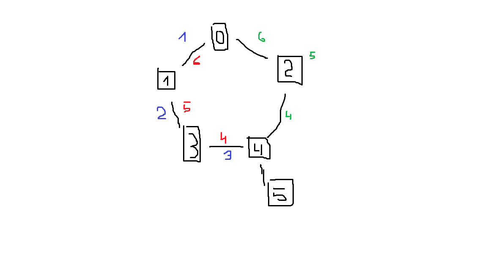
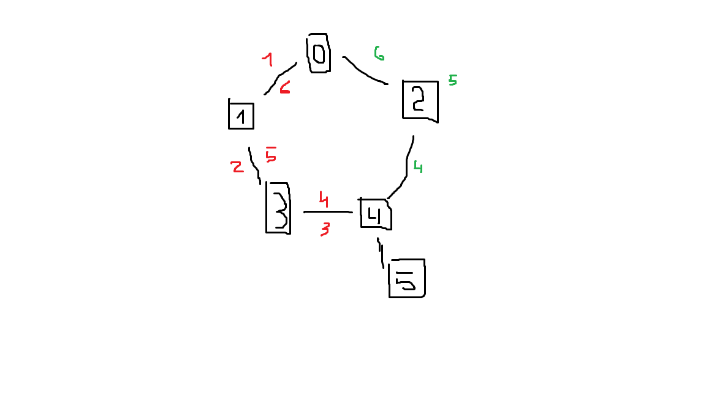

# Улучшение алгоритма Алисы

Общая информация: 
При описании алгоритмов будут приведены рисунки. Условные обозначения: 
- На них маршрут обозначен как возрастающая последовательность цифр в тех местах, где проходит маршрут. 
- Если цифра стоит около ребра - персонаж переходит в другую комнату
- Если стоит около вершины - персонаж собирает наиболее ценный ресурс в комнате, тратя на это 1 единицу еды
- Синими цифрами обозначена общая часть для двух и более маршрутов на картинке
- Красным цветом - маршрут по алгоритму Алисы
- Зеленым цветом - маршрут по новому алгоритму

Сокращения:
1. EE - единица еды (здоровье персонажа)
2. УС - условная стоимость. Чем больше в конце окажется, тем лучше

## Улучшение 1

Сначала рассмотрим алгоритм Алисы.
Первое слабое место в ее стратегии, которое бросается в глаза, заключается в том, что бот, заходя в самую последнюю комнату (Y) перед разворотом назад (X), не сравнивает УС, которые он получит в комнате X, если останется в ней и соберет 2 ресурса оставшихся дорогих ресурса, и в комнате Y, если все-таки зайдет туда и возьмет 1 самый дорогой ресурс.

*В примере 1, который дан в условии, персонаж заходит в комнату 4, берет там 4 gold и возвращается обратно, тратя 2 ЕЕ. За эти же 2 ЕЕ он мог взять 40 exp и 1 iron в комнате 3*.
- УС по алгоритму Алисы: 4 * 11 = **44**
- УС по новому алгоритму: 40 * 1 + 7 * 1 = **47**
 Выигрыш: **3 УС**  Решение: Сравнивать  по УС действия Вперед-Забрать-Назад и Забрать-Забрать в момент, когда ЕЕ на 1 больше, чем 1/2 от исходного числа

## Улучшение 2

Важное упущение в алгоритме Алисы это то, что персонаж должен возвращаться в начальную комнату по уже посещенным комнатам. Из-за этого, когда бот будет строить маршрут для возвращения, не будут учитываться еще не посещенные комнаты, которые могут дать более оптимальный маршрут, как например в том же первом примере:

*Персонаж заходит в вершину 4, а после возвращается по тому же маршруту обратно. Но как можно заметить, маршрут 4-2-0 стоит на 1 единицу еды меньше, поэтому персонаж берет 1 gems в качестве первого ресурса и тратит лишнюю единицу еды на сбор 2-х gold в комнате 3*
 Выигрыш: 46 * 1 + 2 * 11 = **68**  Решение: При составлении конечного маршрута в фазе возращения, учитывать все возможные вершины, маршрут к которым известен персонажу.
